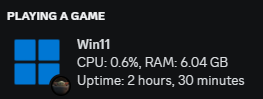

# custom discord rpc

### prerequisites

- [Discord](https://discord.com/)
- [Python](https://www.python.org/)

register an application at [discord dev](https://discord.com/developers/applications), get your client ID under **OAuth2**, you could add your custom images under **Rich Presence Art Assets** as well

### showcase

### instructions

1. **install all python libraries** in your working python environment

   - [pypresence](https://github.com/qwertyquerty/pypresence)
   - [psutil](https://github.com/giampaolo/psutil)

      `pip install pypresence psutil`

2. **replace the placeholders**: make sure to replace the *`client_id`* with your Discord application client ID, and the name of *`large_images`* & *`small_images`* to your application images name. 

3. **start the Discord client**: ensure that your Discord client is up and running.

4. **run the python script**: once you've made the necessary changes to the *`client_id`*, *`large_images`* & *`small_images`* name, run the python script. Your custom rpc should be set.
